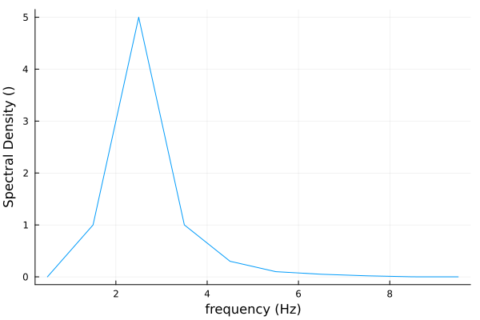
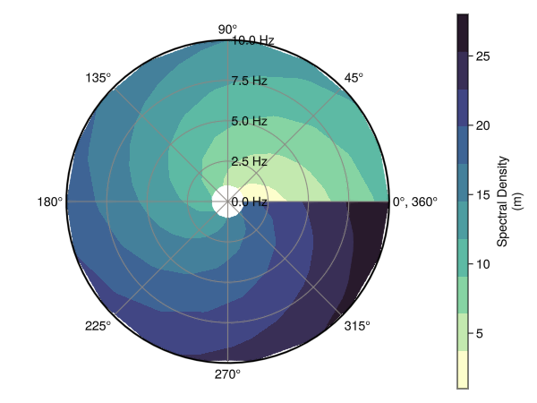

# Basic Functionality

This package leverages [AxisArrays.jl](https://juliaarrays.github.io/AxisArrays.jl/latest/)
for the structure of the data and both 
[Unitful.jl](https://juliaphysics.github.io/Unitful.jl/stable/) and 
[DimensionfulAngles.jl](https://juliaoceanwaves.github.io/DimensionfulAngles.jl/stable/)
to ensure the units of the data are respected in operations and conversions. The accepted
spectral-variable types are temporal/spatial, frequency/period, and linear/angular 
combinations. Represented as a diagram below.


## [Directional Spectra](@id directional_spectra)

[Spectrum](@ref WaveSpectra.Spectrum) objects are directional wave spectra that can be
initialized using an AxisArray matrix with exactly two axes. The axes must both be spectral
variables for a cartesian spectrum or only one should be a direction for a polar spectrum. 
Alternatively you can pass both axes as vectors directly into the constructor. Below is an 
example for creating a spectra with and without AxisArrays.

```julia
julia> using WaveSpectra, DimensionfulAngles

julia> f = (6:6:18) * Hz
(6:6:18) Hz

julia> Θ = (120:120:360) * °
(120:120:360)°

julia> S = Spectrum(ones(Float64, (3, 3)) * m^2/Hz/°, f, Θ)
3×3 Spectrum{m² °⁻¹ Hz⁻¹}{Hz}{°}
Spectral density of the quantity (m²) with polar coordinates:
  • Axis 1: Frequency (Hz)
  • Axis 2: Direction (°)
and data(m² °⁻¹ Hz⁻¹):
 1.0  1.0  1.0
 1.0  1.0  1.0
 1.0  1.0  1.0

julia> A = AxisArray(ones(Float64, (3,3)) * m^2/Hz/°, f, Θ)
2-dimensional AxisArray{Unitful.Quantity{Float64, 𝐋² 𝐓 𝐀⁻¹, Unitful.FreeUnits{(°⁻¹, Hz⁻¹, m²), 𝐋² 𝐓 𝐀⁻¹, nothing}},2,...} with axes:
    :row, (6:6:18) Hz
    :col, (120:120:360)°
And data, a 3×3 Matrix{Unitful.Quantity{Float64, 𝐋² 𝐓 𝐀⁻¹, Unitful.FreeUnits{(°⁻¹, Hz⁻¹, m²), 𝐋² 𝐓 𝐀⁻¹, nothing}}}:
 1.0 m² °⁻¹ Hz⁻¹  1.0 m² °⁻¹ Hz⁻¹  1.0 m² °⁻¹ Hz⁻¹
 1.0 m² °⁻¹ Hz⁻¹  1.0 m² °⁻¹ Hz⁻¹  1.0 m² °⁻¹ Hz⁻¹
 1.0 m² °⁻¹ Hz⁻¹  1.0 m² °⁻¹ Hz⁻¹  1.0 m² °⁻¹ Hz⁻¹

julia> S = Spectrum(A)
3×3 Spectrum{m² °⁻¹ Hz⁻¹}{Hz}{°}
Spectral density of the quantity (m²) with polar coordinates:
  • Axis 1: Frequency (Hz)
  • Axis 2: Direction (°)
and data(m² °⁻¹ Hz⁻¹):
 1.0  1.0  1.0
 1.0  1.0  1.0
 1.0  1.0  1.0
```

You can also use a package like [BuoyData.jl](https://juliaoceanwaves.github.io/BuoyData.jl)
that downloads data from the [National Data Buoy Center](https://www.ndbc.noaa.gov/) and
converts them into Spectrum objects.

```julia
julia> buoy = 46050; year = 2025;

julia> available_pacwave = NDBC.available(buoy, :spectrum; retries = 1)
18×2 DataFrame
 Row │ year   b_file
     │ Int64  Bool
─────┼───────────────
   1 │  2008   false
   2 │  2009   false
   3 │  2010   false
    ...
  16 │  2023   false
  17 │  2024   false
  18 │  2025   false

julia> bfile = available_pacwave[available_pacwave.year .== year, :].b_file == 1
false

julia> data_historical = NDBC.request(buoy, year, bfile)
1-dimensional AxisArray{Spectrum,1,...} with axes:
    :time, Axis{:time, Vector{Dates.DateTime}}([Dates.DateTime("2025-01-01T00:10:00"), Dates.DateTime("2025-01-01T00:40:00"), Dates.DateTime("2025-01-01T01:10:00"), Dates.DateTime("2025-01-01T01:40:00"), Dates.DateTime("2025-01-01T02:10:00"), Dates.DateTime("2025-01-01T02:40:00"), Dates.DateTime("2025-01-01T03:10:00"), Dates.DateTime("2025-01-01T03:40:00"), Dates.DateTime("2025-01-01T04:10:00"), Dates.DateTime("2025-01-01T04:40:00")  …  Dates.DateTime("2025-12-31T19:10:00"), Dates.DateTime("2025-12-31T19:40:00"), Dates.DateTime("2025-12-31T20:10:00"), Dates.DateTime("2025-12-31T20:40:00"), Dates.DateTime("2025-12-31T21:10:00"), Dates.DateTime("2025-12-31T21:40:00"), Dates.DateTime("2025-12-31T22:10:00"), Dates.DateTime("2025-12-31T22:40:00"), Dates.DateTime("2025-12-31T23:10:00"), Dates.DateTime("2025-12-31T23:40:00")])
And data, a 10696-element Vector{Spectrum}:
 47×360-Spectrum{m² Hz⁻¹}{Hz}{°}
 47×360-Spectrum{m² Hz⁻¹}{Hz}{°}
 ⋮
 47×360-Spectrum{m² Hz⁻¹}{Hz}{°}
 47×360-Spectrum{m² Hz⁻¹}{Hz}{°}
 47×360-Spectrum{m² Hz⁻¹}{Hz}{°}
```

Please refer to the full syntax for each function [here](@ref directional_syntax).

## [Omnidirectional Spectra](@id omnidirectional_spectra)
Similar to it's directional counterpart, the 
[OmnidirectionalSpectrum](@ref WaveSpectra.OmnidirectionalSpectrum) constructor can take an
AxisArray object that only has a single axes with any of the compatible units. 
Alternatively, you can pass the vectors directly into the constructor or use another package
that downloads the data. An example showing the initialization with and without an AxisArray
matrix.

```julia
julia> using WaveSpectra, AxisArrays, DimensionfulAngles

julia> Sf = (1.0:4.0) .* m^2/Hz
4-element Vector{Unitful.Quantity{Float64, 𝐋² 𝐓, Unitful.FreeUnits{(Hz⁻¹, m²), 𝐋² 𝐓, nothing}}}:
 1.0 m² Hz⁻¹
 2.0 m² Hz⁻¹
 3.0 m² Hz⁻¹
 4.0 m² Hz⁻¹

julia> f = (1.0:4.0) .* Hz
(1.0:1.0:4.0) Hz

julia> S = OmnidirectionalSpectrum(Sf, f)
4-element OmnidirectionalSpectrum{m² Hz⁻¹}{Hz}
Spectral density of the quantity (m²):
  • Axis: Frequency (Hz)
and data(m² Hz⁻¹):
 1.0
 2.0
 3.0
 4.0

julia> A = AxisArray(Sf, f)
1-dimensional AxisArray{Unitful.Quantity{Float64, 𝐋² 𝐓, Unitful.FreeUnits{(Hz⁻¹, m²), 𝐋² 𝐓, nothing}},1,...} with axes:
    :row, (1.0:1.0:4.0) Hz
And data, a 4-element Vector{Unitful.Quantity{Float64, 𝐋² 𝐓, Unitful.FreeUnits{(Hz⁻¹, m²), 𝐋² 𝐓, nothing}}}:
 1.0 m² Hz⁻¹
 2.0 m² Hz⁻¹
 3.0 m² Hz⁻¹
 4.0 m² Hz⁻¹

julia> S = OmnidirectionalSpectrum(A)
4-element OmnidirectionalSpectrum{m² Hz⁻¹}{Hz}
Spectral density of the quantity (m²):
  • Axis: Frequency (Hz)
and data(m² Hz⁻¹):
 1.0
 2.0
 3.0
 4.0
```

Please refer to the full syntax for each function [here](@ref omnidirectional_syntax).

## Other Spectra Functions
- [Transforming Spectra](@ref transforming_spectra)
- [Integrating Spectra](@ref integrating_spectra)
- [Plotting Spectra](@ref plotting_spectra)
- [Utilities](@ref utilities)

### [Transforming Spectra](@id transforming_spectra)

This package supports the transformation between directional and omnidirectional spectra.
Going from directional to omnidirectional you can call the 
[spread_function](@ref WaveSpectra.spread_function) function and pass
the directional [Spectrum](@ref WaveSpectra.Spectrum) into the 
[OmnidirectionalSpectrum](@ref WaveSpectra.OmnidirectionalSpectrum) constructor or call the 
[split_spectrum](@ref WaveSpectra.split_spectrum) helper functions which uses both and
returns a tuple.

```julia
julia> f = (1.0:4.0) .* Hz
(1.0:4.0) Hz

julia> Θ = (1.0:4.0) .* °
(1.0:4.0) °

julia> S = Spectrum([x + y for x in 0:3, y in 1:4] .* m^2, f, Θ)
4×4 Spectrum{m²}{Hz}{°}
Spectral density of the quantity (° Hz m²) with polar coordinates:
  • Axis 1: Frequency (Hz)
  • Axis 2: Direction (°)
and data(m²):
 1  2  3  4
 2  3  4  5
 3  4  5  6
 4  5  6  7

 julia> S_omni = OmnidirectionalSpectrum(S)
4-element OmnidirectionalSpectrum{° m²}{Hz}
Spectral density of the quantity (° Hz m²):
  • Axis: Frequency (Hz)
and data(° m²):
  7.5
 10.5
 13.5
 16.5

julia> S_spread = spread_function(S)
4×4 Spectrum{°⁻¹}{Hz}{°}
Spectral density of the quantity (Hz) with polar coordinates:
  • Axis 1: Frequency (Hz)
  • Axis 2: Direction (°)
and data(°⁻¹):
 0.13333333333333333  0.26666666666666666  0.4                  0.5333333333333333
 0.19047619047619047  0.2857142857142857   0.38095238095238093  0.47619047619047616
 0.2222222222222222   0.2962962962962963   0.37037037037037035  0.4444444444444444
 0.24242424242424243  0.30303030303030304  0.36363636363636365  0.42424242424242425

julia> S_omni, S_spread = split_spectrum(S)
(4×1-OmnidirectionalSpectrum{° m²}{Hz}, 4×4-Spectrum{°⁻¹}{Hz}{°})

julia> isspread(S_spread)
true
```

This package also allows the conversion of directional spectra from polar to cartesian coordinates
and vice versa.

```julia

julia> f = (1.0:4.0) .* Hz
(1.0:4.0) Hz

julia> Θ = (1.0:4.0) .* °
(1.0:4.0) °

julia> S = Spectrum([x + y for x in 0:3, y in 1:4] .* m^2, f, Θ)
4×4 Spectrum{m²}{Hz}{°}
Spectral density of the quantity (° Hz m²) with polar coordinates:
  • Axis 1: Frequency (Hz)
  • Axis 2: Direction (°)
and data(m²):
 1  2  3  4
 2  3  4  5
 3  4  5  6
 4  5  6  7

julia> polar_to_cartesian(S)
2-dimensional AxisArray{Any,2,...} with axes:
    :point, 1:16
    :component, [:frequency_x, :frequency_y, :spectrum]
And data, a 16×3 Matrix{Any}:
 0.999848 Hz  0.0174524 Hz  1.0 m² rad Hz⁻¹
 1.9997 Hz    0.0349048 Hz  1.0 m² rad Hz⁻¹
 2.99954 Hz   0.0523572 Hz  1.0 m² rad Hz⁻¹
 3.99939 Hz   0.0698096 Hz  1.0 m² rad Hz⁻¹
 ⋮                          
 0.997564 Hz  0.0697565 Hz  4.0 m² rad Hz⁻¹
 1.99513 Hz   0.139513 Hz   2.5 m² rad Hz⁻¹
 2.99269 Hz   0.209269 Hz   2.0 m² rad Hz⁻¹
 3.99026 Hz   0.279026 Hz   1.75 m² rad Hz⁻¹

julia> x1 = (1.0:4.0) .* m
(1.0:4.0) m

julia> x2 = (1.0:4.0) .* m
(1.0:4.0) m

julia> S_cartesian = Spectrum([x + y for x in 0:3, y in 1:4] .* m^3, x1, x2)
4×4 Spectrum{m³}{m}{m}
Spectral density of the quantity (m⁵) with cartesian coordinates:
  • Axis 1: Wavelength (m)
  • Axis 2: Wavelength (m)
and data(m³):
 1  2  3  4
 2  3  4  5
 3  4  5  6
 4  5  6  7

julia> cartesian_to_polar(S_cartesian)
2-dimensional AxisArray{Any,2,...} with axes:
    :point, 1:16
    :component, [:wavelength, :direction, :spectrum]
And data, a 16×3 Matrix{Any}:
 1.41421 m  45.0°      1.41421 m⁴ rad⁻¹
 2.23607 m  26.5651°   4.47214 m⁴ rad⁻¹
 3.16228 m  18.4349°   9.48683 m⁴ rad⁻¹
 4.12311 m  14.0362°  16.4924 m⁴ rad⁻¹
 ⋮                    
 4.12311 m  75.9638°  16.4924 m⁴ rad⁻¹
 4.47214 m  63.4349°  22.3607 m⁴ rad⁻¹
 5.0 m      53.1301°  30.0 m⁴ rad⁻¹
 5.65685 m  45.0°     39.598 m⁴ rad⁻¹

```

Please refer to the full syntax for each function [here](@ref transforming_spectra_syntax).

### [Integrating Spectra](@id integrating_spectra)

In order to enable some of the extended functionality, we needed to define integration rules
for the [Spectrum](@ref WaveSpectra.Spectrum) and 
[OmnidirectionalSpectrum](@ref WaveSpectra.OmnidirectionalSpectrum) objects. Due to
restrictions from the default implementation of the integrate function from 
[Integrals.jl](https://docs.sciml.ai/Integrals/), all spectra must be evenly spaced before
calling the integrate functions. The rectangular rule for integration was also implemented
as an alternative integration rule.

```julia
julia> x_err = [1.0, 2.5, 3.1, 4.2, 5.22]*Hz
5-element Vector{Quantity{Float64, 𝐓⁻¹, Unitful.FreeUnits{(Hz,), 𝐓⁻¹, nothing}}}:
 1.0 Hz
 2.5 Hz
 3.1 Hz
 4.2 Hz
 5.22 Hz

julia> S = OmnidirectionalSpectrum((1.0:5.0).*m^2/Hz, x_err)
5-element OmnidirectionalSpectrum{m² Hz⁻¹}{Hz}
Spectral density of the quantity (m²):
  • Axis: Frequency (Hz)
and data(m² Hz⁻¹):
 1.0
 2.0
 3.0
 4.0
 5.0

julia> evenspacing(S)
ERROR: ArgumentError: Vector `x` must be evenly spaced.

julia> S = OmnidirectionalSpectrum((1.0:5.0)*m^2/Hz, (1.0:5.0)*Hz)
5-element OmnidirectionalSpectrum{m² Hz⁻¹}{Hz}
Spectral density of the quantity (m²):
  • Axis: Frequency (Hz)
and data(m² Hz⁻¹):
 1.0
 2.0
 3.0
 4.0
 5.0

julia> integrate(S)
12.0 m²

julia> integrate(S, method=RectangularRule())
15.0 m²
```

Please refer to the full syntax for each function [here](@ref integrating_spectra_syntax).

### [Plotting Spectra](@id plotting_spectra)

The [Plots.jl](https://docs.juliaplots.org/stable/) recipe for plotting omnidirectional 
spectra is functional, and there is a helper function for plotting a polar spectra using
[Makie](https://docs.makie.org/stable/). 

```julia
julia> f = (0.5:1:9.5) * Hz
(0.5:1.0:9.5) Hz

julia> Sf = [0, 1, 5, 1, 0.3, 0.1, 0.05, 0.02, 0.001, 0]
10-element Vector{Float64}:
 0.0
 1.0
 5.0
 1.0
 0.3
 0.1
 0.05
 0.02
 0.001
 0.0

julia> S = OmnidirectionalSpectrum(Sf, f)
10-element OmnidirectionalSpectrum{1}{Hz}
Spectral density of the quantity (Hz):
  • Axis: Frequency (Hz)
and data(1):
 0.0
 1.0
 5.0
 1.0
 0.3
 0.1
 0.05
 0.02
 0.001
 0.0

julia> plot(S)
```



```julia
julia> f = (1.0:10.0) * Hz
(1.0:10.0) Hz

julia> Θ = (0.0:20:360) * °
Θ = (0.0:20:360) °

julia> S = Spectrum([x + y for x in 0:9, y in 1:19], f, Θ)
10×19 Spectrum{1}{Hz}{°}
Spectral density of the quantity (° Hz) with polar coordinates:
  • Axis 1: Frequency (Hz)
  • Axis 2: Direction (°)
and data(1):
  1   2   3   4   5   6   7   8   9  10  11  12  13  14  15  16  17  18  19
  2   3   4   5   6   7   8   9  10  11  12  13  14  15  16  17  18  19  20
  3   4   5   6   7   8   9  10  11  12  13  14  15  16  17  18  19  20  21
  4   5   6   7   8   9  10  11  12  13  14  15  16  17  18  19  20  21  22
  5   6   7   8   9  10  11  12  13  14  15  16  17  18  19  20  21  22  23
  6   7   8   9  10  11  12  13  14  15  16  17  18  19  20  21  22  23  24
  7   8   9  10  11  12  13  14  15  16  17  18  19  20  21  22  23  24  25
  8   9  10  11  12  13  14  15  16  17  18  19  20  21  22  23  24  25  26
  9  10  11  12  13  14  15  16  17  18  19  20  21  22  23  24  25  26  27
 10  11  12  13  14  15  16  17  18  19  20  21  22  23  24  25  26  27  28

julia> plot_spectrum(S)
```



Please refer to the full syntax for each function [here](@ref plotting_spectra_syntax).

### [Utilities](@id utilities)

With both spectra, there are a few functionalities that were extended from their respective
libraries. 

```julia
julia> f = (6:6:18) * Hz
(6:6:18) Hz

julia> Θ = (120:120:360) * °
(120:120:360)°

julia> S_dir = Spectrum(ones(Float64, (3, 3)) * m^2/Hz/°, f, Θ)
3×3 Spectrum{m² °⁻¹ Hz⁻¹}{Hz}{°}
Spectral density of the quantity (m²) with polar coordinates:
  • Axis 1: Frequency (Hz)
  • Axis 2: Direction (°)
and data(m² °⁻¹ Hz⁻¹):
 1.0  1.0  1.0
 1.0  1.0  1.0
 1.0  1.0  1.0

julia> axesinfo(S_dir)
(((:temporal, :linear, :frequency), 𝐓⁻¹), ((:direction,), 𝐀))

julia> unit(S_dir)
m² °⁻¹ Hz⁻¹

julia> uconvert(Unitful.cm^2, S_dir)
3×3 Spectrum{cm² °⁻¹ Hz⁻¹}{Hz}{°}
Spectral density of the quantity (cm²) with polar coordinates:
  • Axis 1: Frequency (Hz)
  • Axis 2: Direction (°)
and data(cm² °⁻¹ Hz⁻¹):
 10000.0  10000.0  10000.0
 10000.0  10000.0  10000.0
 10000.0  10000.0  10000.0
```

Please refer to the full syntax for each function [here](@ref utilities_syntax).

## Syntax

  - [Directional Spectra](@ref directional_syntax)
  - [Omnidirectional Spectra](@ref omnidirectional_syntax)
  - Other Spectra Functions
    - [Transforming Spectra](@ref transforming_spectra_syntax)
    - [Integrating Spectra](@ref integrating_spectra_syntax)
    - [Plotting Spectra](@ref plotting_spectra_syntax)
    - [Utilities](@ref utilities_syntax)

### [Directional Spectra](@id directional_syntax)
```@autodocs; canonical=false
Modules = [WaveSpectra]
Filter = x -> (regex_match(r"Spectrum", x) && !regex_match(r"Omni", x))
```

### [Omnidirectional Spectra](@id omnidirectional_syntax)
```@autodocs; canonical=false
Modules = [WaveSpectra]
Filter = x -> (regex_match(r"Spectrum", x) && regex_match(r"Omni", x))
```

### [Transforming Spectra](@id transforming_spectra_syntax)
```@docs; canonical=false
WaveSpectra.spread_function
WaveSpectra.split_spectrum
WaveSpectra.isspread
WaveSpectra.polar_to_cartesian
WaveSpectra.cartesian_to_polar
```

### [Integrating Spectra](@id integrating_spectra_syntax)
```@docs; canonical=false
WaveSpectra.evenspacing
WaveSpectra.isevenlyspaced
WaveSpectra.integrate
```

### [Plotting Spectra](@id plotting_spectra_syntax)
```@docs; canonical=false
WaveSpectra.plot_spectrum
```

### [Utilities](@id utilities_syntax)
```@docs; canonical=false
WaveSpectra.axesinfo
WaveSpectra.uconvert
WaveSpectra.unit
```