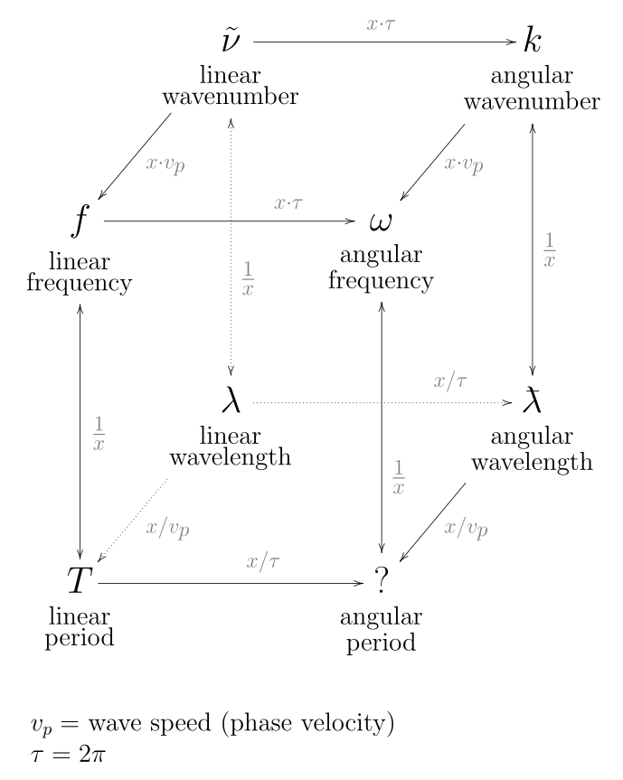

# Core Functionality

Leveraging the [AxisArrays.jl](https://juliaarrays.github.io/AxisArrays.jl/latest/)
we store additional information such as the 
[Unitful.jl](https://juliaphysics.github.io/Unitful.jl/stable/)
and [DimensionfulAngles.jl](https://juliaoceanwaves.github.io/DimensionfulAngles.jl/stable/)
quantities. This helps preserve the units across transformations and ensure that all
operations respect the units of the data. DimensionfulAngles extends the functionality of
Unitful quantities to angles and this package leverages this to ensure consistency when
dealing with WaveSpectra. Below is an example of the former; normally Unitful would not 
correctly handle the conversion from _degrees_ to _radians_ as they are both considered 
unitless.

```julia
using WaveSpectra, AxisArrays, DimensionfulAngles

julia> f = (6:6:18) * Hz

(6:6:18) Hz

julia> Θ = (120:120:360) * °

(120:120:360)°

julia> A = AxisArray(ones(Float64, (3, 3)) * m^2/Hz/°, f, Θ)

2-dimensional AxisArray{Unitful.Quantity{Float64, 𝐋² 𝐓 𝐀⁻¹, Unitful.FreeUnits{(°⁻¹, Hz⁻¹, m²), 𝐋² 𝐓 𝐀⁻¹, nothing}},2,...} with axes:
    :row, (6:6:18) Hz
    :col, (120:120:360)°
And data, a 3×3 Matrix{Unitful.Quantity{Float64, 𝐋² 𝐓 𝐀⁻¹, Unitful.FreeUnits{(°⁻¹, Hz⁻¹, m²), 𝐋² 𝐓 𝐀⁻¹, nothing}}}:
 1.0 m² °⁻¹ Hz⁻¹  1.0 m² °⁻¹ Hz⁻¹  1.0 m² °⁻¹ Hz⁻¹
 1.0 m² °⁻¹ Hz⁻¹  1.0 m² °⁻¹ Hz⁻¹  1.0 m² °⁻¹ Hz⁻¹
 1.0 m² °⁻¹ Hz⁻¹  1.0 m² °⁻¹ Hz⁻¹  1.0 m² °⁻¹ Hz⁻¹

julia> S1 = Spectrum(A)

3×3 Spectrum{m² °⁻¹ Hz⁻¹}{Hz}{°}
Spectral density of the quantity (m²) with polar coordinates:
  • Axis 1: Frequency (Hz)
  • Axis 2: Direction (°)
and data(m² °⁻¹ Hz⁻¹):
 1.0  1.0  1.0
 1.0  1.0  1.0
 1.0  1.0  1.0

julia> S2 = uconvert(m^2, Hz, rad, S1)

3×3 Spectrum{m² Hz⁻¹ rad⁻¹}{Hz}{rad}
Spectral density of the quantity (m²) with polar coordinates:
  • Axis 1: Frequency (Hz)
  • Axis 2: Direction (rad)
and data(m² Hz⁻¹ rad⁻¹):
 57.29577951308232  57.29577951308232  57.29577951308232
 57.29577951308232  57.29577951308232  57.29577951308232
 57.29577951308232  57.29577951308232  57.29577951308232
```

In scenarios where the user is working with multiple spectra, this package will handle
conversions when appropriate:

```julia
julia> S1

3×3 Spectrum{m² °⁻¹ Hz⁻¹}{Hz}{°}
Spectral density of the quantity (m²) with polar coordinates:
  • Axis 1: Frequency (Hz)
  • Axis 2: Direction (°)
and data(m² °⁻¹ Hz⁻¹):
 1.0  1.0  1.0
 1.0  1.0  1.0
 1.0  1.0  1.0

julia> S2

3×3 Spectrum{m² Hz⁻¹ rad⁻¹}{Hz}{rad}
Spectral density of the quantity (m²) with polar coordinates:
  • Axis 1: Frequency (Hz)
  • Axis 2: Direction (rad)
and data(m² Hz⁻¹ rad⁻¹):
 57.29577951308232  57.29577951308232  57.29577951308232
 57.29577951308232  57.29577951308232  57.29577951308232
 57.29577951308232  57.29577951308232  57.29577951308232

julia> S1 + S2

3×3 Spectrum{m² s rad⁻¹}{Hz}{°}
Spectral density of the quantity (° Hz m² s rad⁻¹) with polar coordinates:
  • Axis 1: Frequency (Hz)
  • Axis 2: Direction (°)
and data(m² s rad⁻¹):
 114.59155902616465  114.59155902616465  114.59155902616465
 114.59155902616465  114.59155902616465  114.59155902616465
 114.59155902616465  114.59155902616465  114.59155902616465
```

and will notify the user when otherwise incompatible.

```julia
julia> f = (6:6:18) * Hz

(6:6:18) Hz

julia> Θ = (120:120:360) * °

(120:120:360)°

julia> A3 = AxisArray(ones(Float64, (3, 3)) * m^3/Hz/°, f, Θ)

2-dimensional AxisArray{Unitful.Quantity{Float64, 𝐋³ 𝐓 𝐀⁻¹, Unitful.FreeUnits{(°⁻¹, Hz⁻¹, m³), 𝐋³ 𝐓 𝐀⁻¹, nothing}},2,...} with axes:
    :row, (6:6:18) Hz
    :col, (120:120:360)°
And data, a 3×3 Matrix{Unitful.Quantity{Float64, 𝐋³ 𝐓 𝐀⁻¹, Unitful.FreeUnits{(°⁻¹, Hz⁻¹, m³), 𝐋³ 𝐓 𝐀⁻¹, nothing}}}:
 1.0 m³ °⁻¹ Hz⁻¹  1.0 m³ °⁻¹ Hz⁻¹  1.0 m³ °⁻¹ Hz⁻¹
 1.0 m³ °⁻¹ Hz⁻¹  1.0 m³ °⁻¹ Hz⁻¹  1.0 m³ °⁻¹ Hz⁻¹
 1.0 m³ °⁻¹ Hz⁻¹  1.0 m³ °⁻¹ Hz⁻¹  1.0 m³ °⁻¹ Hz⁻¹

julia> S3 = Spectrum(A3)

3×3 Spectrum{m³ °⁻¹ Hz⁻¹}{Hz}{°}
Spectral density of the quantity (m³) with polar coordinates:
  • Axis 1: Frequency (Hz)
  • Axis 2: Direction (°)
and data(m³ °⁻¹ Hz⁻¹):
 1.0  1.0  1.0
 1.0  1.0  1.0
 1.0  1.0  1.0

julia> S1 + S3

ERROR: DimensionError: 1.0 m² °⁻¹ Hz⁻¹ and 1.0 m³ °⁻¹ Hz⁻¹ are not dimensionally compatible.
```

The following quantities are accepted for the axes and their respective conversions are implemented in
this package. Any other type of spectra are not supported.



## Syntax
```@autodocs; canonical=false
Modules = [WaveSpectra]
Filter = x -> !isnothing(match(r"Spectrum", string(x)))
```