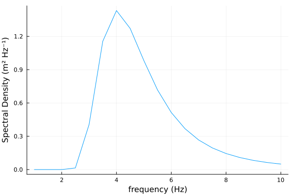

# Quickstart

## Introduction

You can construct a [Spectrum](@ref WaveSpectra.Spectrum) by passing a matrix and two axes 
with units. The axes can both be spectral variables for a cartesian spectrum or 
only one is a direction for a polar spectrum, below is an example of the cartesian spectrum.

```julia
julia> x1 = (1.0:4.0) .* Hz; x2 = (1.0:4.0) .* °;

julia> S = Spectrum(ones(Float64, (4,4)) .* m^2, x1, x2)
4×4 Spectrum{m²}{Hz}{°}
Spectral density of the quantity (° Hz m²) with polar coordinates:
  • Axis 1: Frequency (Hz)
  • Axis 2: Direction (°)
and data(m²):
 1.0  1.0  1.0  1.0
 1.0  1.0  1.0  1.0
 1.0  1.0  1.0  1.0
 1.0  1.0  1.0  1.0
```

## Unit Compatibility

Leveraging [AxisArrays.jl](https://juliaarrays.github.io/AxisArrays.jl/latest/)
we store additional information like the 
[Unitful.jl](https://juliaphysics.github.io/Unitful.jl/stable/)
and [DimensionfulAngles.jl](https://juliaoceanwaves.github.io/DimensionfulAngles.jl/stable/)
quantities. This helps preserve the units across transformations and ensure that all
operations respect the units of the data. DimensionfulAngles extends the functionality of
Unitful quantities to angles and this package uses that functionality to ensure 
consistency when dealing with wave spectra. Below is an example of the former; Unitful 
normally would not handle correctly the conversion from _degrees_ to _radians_ as they are 
both considered unitless.

```julia
using WaveSpectra, AxisArrays, DimensionfulAngles

julia> f = (6:6:18) * Hz; Θ = (120:120:360) * °;

julia> A = AxisArray(ones(Float64, (3, 3)) * m^2/Hz/°, f, Θ);

julia> S1 = Spectrum(A)

3×3 Spectrum{m² °⁻¹ Hz⁻¹}{Hz}{°}
Spectral density of the quantity (m²) with polar coordinates:
  • Axis 1: Frequency (Hz)
  • Axis 2: Direction (°)
and data(m² °⁻¹ Hz⁻¹):
 1.0  1.0  1.0
 1.0  1.0  1.0
 1.0  1.0  1.0

julia> S2 = uconvert(m^2, Hz, rad, S1)

3×3 Spectrum{m² Hz⁻¹ rad⁻¹}{Hz}{rad}
Spectral density of the quantity (m²) with polar coordinates:
  • Axis 1: Frequency (Hz)
  • Axis 2: Direction (rad)
and data(m² Hz⁻¹ rad⁻¹):
 57.29577951308232  57.29577951308232  57.29577951308232
 57.29577951308232  57.29577951308232  57.29577951308232
 57.29577951308232  57.29577951308232  57.29577951308232
```

In scenarios where the user is working with multiple spectra, this package will handle
conversions when appropriate:

```julia
julia> S1

3×3 Spectrum{m² °⁻¹ Hz⁻¹}{Hz}{°}
Spectral density of the quantity (m²) with polar coordinates:
  • Axis 1: Frequency (Hz)
  • Axis 2: Direction (°)
and data(m² °⁻¹ Hz⁻¹):
 1.0  1.0  1.0
 1.0  1.0  1.0
 1.0  1.0  1.0

julia> S2

3×3 Spectrum{m² Hz⁻¹ rad⁻¹}{Hz}{rad}
Spectral density of the quantity (m²) with polar coordinates:
  • Axis 1: Frequency (Hz)
  • Axis 2: Direction (rad)
and data(m² Hz⁻¹ rad⁻¹):
 57.29577951308232  57.29577951308232  57.29577951308232
 57.29577951308232  57.29577951308232  57.29577951308232
 57.29577951308232  57.29577951308232  57.29577951308232

julia> S1 + S2

3×3 Spectrum{m² s rad⁻¹}{Hz}{°}
Spectral density of the quantity (° Hz m² s rad⁻¹) with polar coordinates:
  • Axis 1: Frequency (Hz)
  • Axis 2: Direction (°)
and data(m² s rad⁻¹):
 114.59155902616465  114.59155902616465  114.59155902616465
 114.59155902616465  114.59155902616465  114.59155902616465
 114.59155902616465  114.59155902616465  114.59155902616465
```

and will notify the user when otherwise incompatible.

```julia
julia> f = (6:6:18) * Hz; Θ = (120:120:360) * °;

julia> A3 = AxisArray(ones(Float64, (3, 3)) * m^3/Hz/°, f, Θ); # Cubic meters

julia> S3 = Spectrum(A3)

3×3 Spectrum{m³ °⁻¹ Hz⁻¹}{Hz}{°}
Spectral density of the quantity (m³) with polar coordinates:
  • Axis 1: Frequency (Hz)
  • Axis 2: Direction (°)
and data(m³ °⁻¹ Hz⁻¹):
 1.0  1.0  1.0
 1.0  1.0  1.0
 1.0  1.0  1.0

julia> S1 + S3

ERROR: DimensionError: 1.0 m² °⁻¹ Hz⁻¹ and 1.0 m³ °⁻¹ Hz⁻¹ are not dimensionally compatible.
```

The accepted spectral-variables types are temporal/spatial, frequency/period, and 
linear/angular combinations. Represented as a diagram [here](@ref spectral_var_cube).

## Characterization

This package also includes a few functions to characterize ocean wave spectra both for 
[directional spectra](@ref directional_spectra) and 
[omnidirectional spectra](@ref omnidirectional_spectra).

```julia
julia> f = (6:6:18) * Hz; Θ = (120:120:360) * °;

julia> A = AxisArray(Float64.([x+y for x in 0:2, y in 0:2]) * m^2/Hz/°, f, Θ);

julia> S = Spectrum(A)
3×3 Spectrum{m² °⁻¹ Hz⁻¹}{Hz}{°}
Spectral density of the quantity (m²) with polar coordinates:
  • Axis 1: Frequency (Hz)
  • Axis 2: Direction (°)
and data(m² °⁻¹ Hz⁻¹):
 0.0  1.0  2.0
 1.0  2.0  3.0
 2.0  3.0  4.0

julia> WaveSpectra.Moments.mean_direction(S)
-79.10660535086907°
```

```julia
julia> S_omni = OmnidirectionalSpectrum((1.0:3.0) .* m^2/Hz, (1.0:3.0) .* Hz)
3-element OmnidirectionalSpectrum{m² Hz⁻¹}{Hz}
Spectral density of the quantity (m²):
  • Axis: Frequency (Hz)
and data(m² Hz⁻¹):
 1.0
 2.0
 3.0

julia> WaveSpectra.Moments.significant_waveheight(S_omni)
8.0 m

julia> WaveSpectra.Moments.energy_frequency(S_omni)
2.0 Hz
```


## Other Functions

This package also includes a few functions to create a omnidirectional parametric spectra.

```julia
julia> f = (1.0:0.5:10.0) .* Hz;

julia> PM = WaveSpectra.ParametricSpectra.spectrum_pierson_moskowitz(f, 8.0 * m, 4.0 * Hz, peak_frequency=true)
19-element OmnidirectionalSpectrum{m² Hz⁻¹}{Hz}
Spectral density of the quantity (m²):
  • Axis: Frequency (Hz)
and data(m² Hz⁻¹):
 1.3423912370794646e-72
 4.849071845233627e-13
 0.001701611389553719
 0.335309891337633
 1.3421276585162367
 1.6633580565889663
 ⋮
 0.08116740160851418
 0.0604917892588704
 0.045764352079589225
 0.035103816684478595
 0.02727015323859412

julia> plot(PM)
```


## [Syntax](@id intro_syntax)

  - [Spectrum](@ref intro_syntax)
  - [Units](@ref units_intro_syntax)
  - [Characterization](@ref charecterization_syntax)
  - [Other](@ref parametricspectra_syntax)

```@autodocs; canonical=false
Modules = [WaveSpectra]
Filter = x -> (regex_match(r"Spectrum", x) && !regex_match(r"Omni", x))
```

### [Syntax for Units](@id units_intro_syntax)

```@docs; canonical=false
WaveSpectra.uconvert
WaveSpectra.unit
```

### [Syntax for Characterization Methods](@id charecterization_syntax)

```@autodocs; canonical=false
Modules = [WaveSpectra.Moments]
Order   = [:function, :type]
```

### [Syntax for Parametric Spectra](@id parametricspectra_syntax)

```@autodocs; canonical=false
Modules = [WaveSpectra.ParametricSpectra]
Order   = [:function, :type]
```